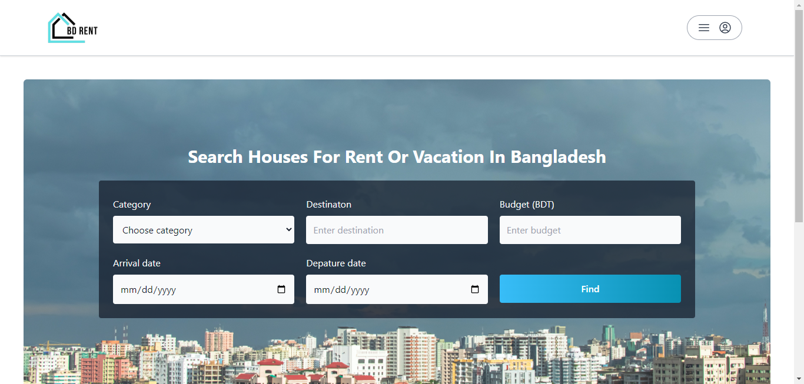

# BD Rent

## Live Link

Hosted in Vercel -> [BD Rent](https://bdrent.vercel.app/)

## Features

- Dedicated dashboard for admins, host, and users
- Payment integration with Stripe and SSLCommerz
- User authentication by Firebase
- Identify authenticated users by Json Web Token
- User can search houses by category, destination, budget, etc
- User can book house and can cancel already booked house
- Host can add new house, delete house, and update house
- Host can cancel booking of his house that is already booked by user
- Host will get an email when a user books his house
- Admin can see all the bookings and their details and also can cancel any booking
- Admin can approve host request
- Admin can can see all the users and their details
- Chatbot for user support
- 404 Error Page
- Responsive
- Easy to navigate

## Resources & Credits

- Different Tailwind Components
- [Stripe](https://stripe.com/)
- [Hero icons](https://heroicons.com/)
- [Axios](https://axios-http.com/)
- [React hot toast](https://react-hot-toast.com/)
- [Date fns](https://www.npmjs.com/package/date-fns)
- [Nodemailer](https://nodemailer.com/)
- [React photo view](https://www.npmjs.com/package/react-photo-view)

## Tech Stack

- TailwindCSS
- React
- React Router
- Node JS
- Express JS
- MongoDB
- Firebase
- Json Web Token
- Stripe
- Vercel
